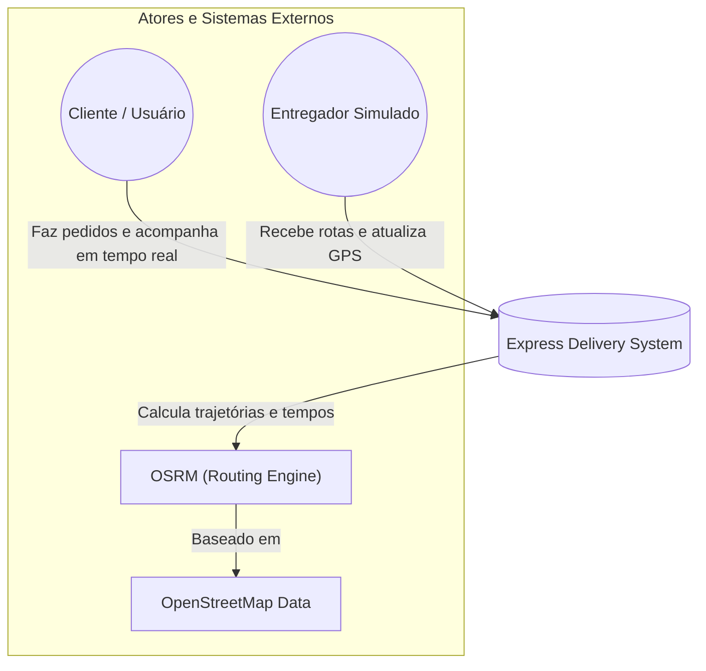
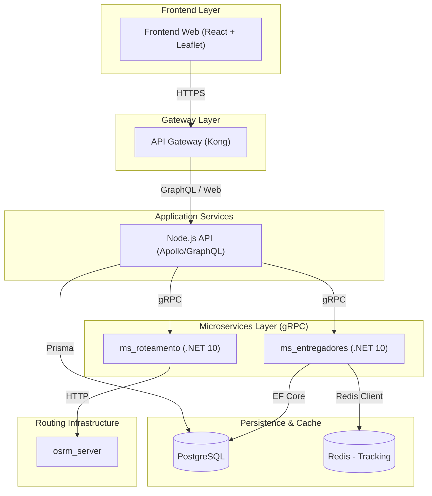

# 📦 Express Delivery - Real-time Microservices Simulation

Este projeto é um ecossistema de alta performance projetado para demonstrar a aplicação prática de arquiteturas modernas e escaláveis. Desenvolvido com foco em **Microserviços**, **Comunicação gRPC** e **Geoprocessamento**, ele serve como um demonstrador técnico de conceitos robustos de engenharia de software para portfólio de alto nível.

---

## 🏛️ Arquitetura do Sistema (Modelo C4)

Utilizamos o Modelo C4 para descrever a estrutura do sistema, permitindo visualizar desde a interação do usuário até os detalhes técnicos dos serviços.

### Nível 1: Contexto do Sistema (System Context)
O sistema atua como o orquestrador central entre os usuários finais, a frota de entregadores simulada e o motor de roteamento geográfico (OSRM).



### Nível 2: Contêineres (Containers)
Abaixo, a topologia de rede do ecossistema Docker. **Nota:** Todo o tráfego externo é centralizado pelo API Gateway (Kong), garantindo segurança e padronização.



---

## 🚀 Como Rodar o Projeto

A aplicação é totalmente conteinerizada com **Docker**. Siga os passos abaixo:

### 1. Pré-requisitos
*   Docker e Docker Compose instalado.
*   Pelo menos 8GB de RAM livre (para o servidor de roteamento OSRM).

### 2. Preparando os Dados de Mapa (OSRM)
1. **Download**: Baixe o mapa da região Sudeste em [Geofabrik](https://download.geofabrik.de/south-america/brazil.html) (`sudeste-latest.osm.pbf`).
2. **Compilação**: Coloque o arquivo em `./osrm-data/` e execute:
   ```bash
   docker run -t -v "${PWD}/osrm-data:/data" osrm/osrm-backend osrm-extract -p /opt/car.lua /data/seu-arquivo.osm.pbf
   docker run -t -v "${PWD}/osrm-data:/data" osrm/osrm-backend osrm-partition /data/seu-arquivo.osrm
   docker run -t -v "${PWD}/osrm-data:/data" osrm/osrm-backend osrm-customize /data/seu-arquivo.osrm
   ```
3. **Configuração**: Verifique se o nome do arquivo no `compose.yml` (`osrm-server`) condiz com o arquivo gerado (ex: `sudeste-260326.osrm`).

### 3. Execução
```bash
cp .env.example .env
docker compose up --build
```

---

## 🕹️ Manual de Voo: Guia de Simulação

1.  **Acesso**: Acesse `http://localhost:8000`. (O tráfego passa pelo Kong Gateway).
2.  **Login**: Registre-se e faça login. Seu endereço servirá de destino para as entregas.
3.  **Radar**: Observe os entregadores se movendo no mapa. Eles atualizam o **Redis** a cada 3 segundos.
4.  **Compra**: Escolha um restaurante e clique em "Comprar".
5.  **Painel Técnico**: No menu lateral, simule as ações do motoboy para ver o rastreamento em tempo real via **gRPC** e **OSRM**.

> [!CAUTION]
> **Persistência de Dados**: O arquivo `compose.yml` está configurado com `--force-reset`. Isso garante que o ambiente de teste sempre inicie em um estado limpo e controlado.

---

## 🛠️ Stack Tecnológica

| Componente | Tecnologia | Papel |
| :--- | :--- | :--- |
| **Frontend** | React, Leaflet | UI moderna e visualização de geoprocessamento |
| **Gateway** | Kong Gateway | Porta de entrada profissional, JWT e Rate Limit |
| **API Principal** | Node.js, GraphQL | Orquestração de Microserviços e Schema unificado |
| **Microserviços** | .NET 10 (C#), gRPC | Performance extrema e lógica de negócio |
| **Dados** | PostgreSQL, Redis | Persistência relacional e cache de localização ultra-rápido |
| **Roteamento** | OSRM Engine | Inteligência logística baseada em OpenStreetMap |

---

## 📡 Endpoints de Acesso (Via Gateway)
*   **Aplicação Web (Frontend)**: [http://localhost:8000](http://localhost:8000)
*   **GraphQL Playground (API)**: [http://localhost:8000/graphql](http://localhost:8000/graphql)
*   **OSRM (Direto)**: [http://localhost:5080](http://localhost:5080)

---

## 🚧 Status e Visão de Futuro (Roadmap)

Este projeto está em desenvolvimento contínuo, servindo como um **laboratório vivo de arquitetura de software**. O objetivo é consolidar tanto conceitos fundamentais quanto as tendências de mercado mais avançadas.

### Próximas Evoluções Planejadas:
*   **Mensageria & Resiliência**: Implementação de comunicação assíncrona com **RabbitMQ** e padrões de tolerância a falhas (Circuit Breaker).
*   **Checkout & Pagamentos**: Integração de um gateway profissional (Stripe) para simulação de fluxos financeiros reais.
*   **Qualidade & Design**: Refatoração profunda aplicando **Domain-Driven Design (DDD)** e princípios **SOLID**.
*   **Escalabilidade**: Expansão da malha com novos microserviços especializados.
*   **Documentação Avançada**: Evolução completa do Modelo C4 até o nível de código.

---
*Este projeto demonstra o compromisso com a excelência técnica e a paixão por arquiteturas de software complexas.*
