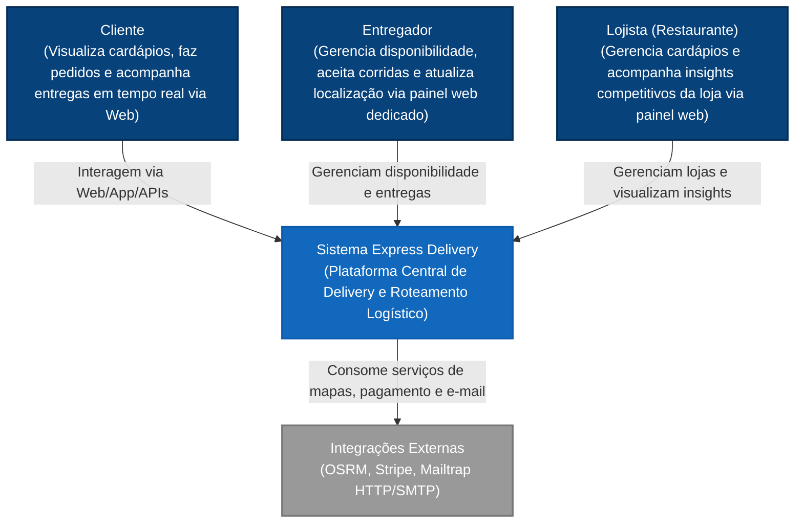
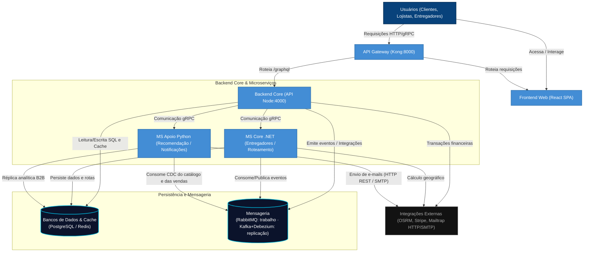
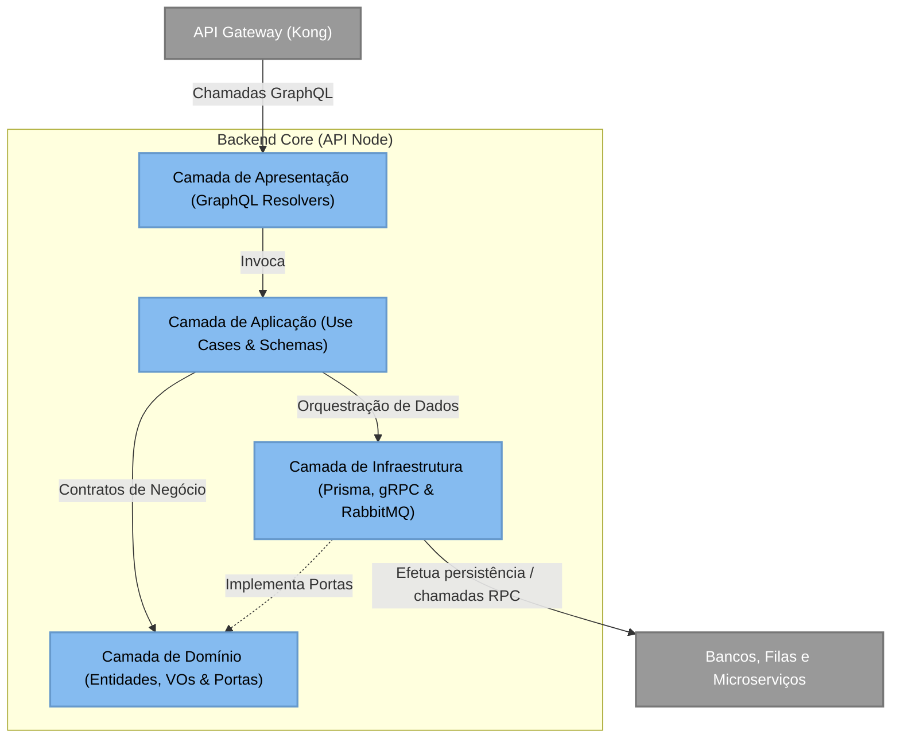

# 📦 Express Delivery - Real-time Microservices Simulation

Este projeto é um ecossistema de alta performance projetado para demonstrar a aplicação prática de arquiteturas modernas e escaláveis. Desenvolvido com foco em **Microserviços**, **Comunicação gRPC** e **Geoprocessamento**, o foco principal reside na implementação de padrões de resiliência e baixa latência em sistemas distribuídos.

---

## 🗺️ A arquitetura em uma tela

Antes de descer nos níveis do C4, o mapa completo:
**[Visão Geral da Arquitetura](docs/diagramas/visao-geral.md)** — todos os
contêineres, os dois brokers e o pipeline de CDC num diagrama só.

Existe também uma **[versão interativa](https://arthurair3s.github.io/express-delivery-system/diagramas/planta.html)**:
clique numa peça para isolar as dependências dela, filtre por camada e leia a
ficha técnica de cada contêiner. É a versão para apresentar o projeto.

---

## 🏛️ Arquitetura do Sistema (Modelo C4)

Utilizamos o Modelo C4 para descrever a estrutura do sistema, dividindo-a em três níveis de detalhamento (Contexto, Contêineres e Componentes) de forma limpa e integrada.

### Nível 1: Contexto do Sistema (System Context)
Apresenta a visão panorâmica de alto nível e como o ecossistema Express Delivery interage com seus diferentes usuários e integrações de terceiros.


```mermaid
graph TD
    %% Styling
    classDef person fill:#08427b,stroke:#052e56,stroke-width:2px,color:#fff;
    classDef system fill:#1168bd,stroke:#0e5aab,stroke-width:2px,color:#fff;
    classDef ext fill:#999999,stroke:#777777,stroke-width:2px,color:#fff;

    %% Elements
    cliente["Cliente<br>(Visualiza cardápios, faz pedidos e acompanha entregas em tempo real via Web)"]:::person
    entregador["Entregador<br>(Gerencia disponibilidade, aceita corridas e atualiza localização via painel web dedicado)"]:::person
    lojista["Lojista (Restaurante)<br>(Gerencia cardápios e acompanha insights competitivos da loja via painel web)"]:::person

    express_delivery["Sistema Express Delivery<br>(Plataforma Central de Delivery e Roteamento Logístico)"]:::system
    externos["Integrações Externas<br>(OSRM, Stripe, Mailtrap HTTP/SMTP)"]:::ext

    cliente -->|Interagem via Web/App/APIs| express_delivery
    entregador -->|Gerenciam disponibilidade e entregas| express_delivery
    lojista -->|Gerenciam lojas e visualizam insights| express_delivery
    express_delivery -->|Consome serviços de mapas, pagamento e e-mail| externos
```
> 🔗 [Nível 1 detalhado, com legenda e fronteira do sistema](docs/diagramas/c1/c4_l1_context.md)

### Nível 2: Contêineres (Containers)
Aumenta o detalhamento expondo a topologia de microsserviços, bancos de dados, cache, brokers de mensagens e telemetria que compõem o ecossistema.


```mermaid
graph TD
    %% Styling
    classDef client fill:#08427b,stroke:#052e56,stroke-width:2px,color:#fff;
    classDef container fill:#438dd5,stroke:#3b7bb5,stroke-width:2px,color:#fff;
    classDef db fill:#0b132b,stroke:#00b4d8,stroke-width:2px,color:#fff;
    classDef broker fill:#2d1a12,stroke:#f8961e,stroke-width:2px,color:#fff;
    classDef ext fill:#121212,stroke:#666,stroke-width:1px,color:#aaa;

    cliente["Usuários (Clientes, Lojistas, Entregadores)"]:::client
    gateway["API Gateway (Kong:8000)"]:::container
    frontend["Frontend Web (React SPA)"]:::container

    subgraph "Backend Core & Microserviços"
        api_node["Backend Core (API Node:4000)"]:::container
        ms_dotnet["MS Core .NET (Entregadores / Roteamento)"]:::container
        ms_python["MS Apoio Python (Recomendação / Notificações)"]:::container
    end

    subgraph "Persistência e Mensageria"
        databases[("Bancos de Dados & Cache<br>(PostgreSQL / Redis)")]:::db
        messaging[("Mensageria<br>(RabbitMQ: trabalho · Kafka+Debezium: replicação)")]:::db
    end

    ext["Integrações Externas (OSRM, Stripe, Mailtrap HTTP/SMTP)"]:::ext

    %% Flows
    cliente -->|Acessa / Interage| frontend
    cliente -->|Requisições HTTP/gRPC| gateway
    gateway -->|Roteia requisições| frontend
    gateway -->|Roteia /graphql| api_node

    api_node -->|Comunicação gRPC| ms_dotnet
    api_node -->|Comunicação gRPC| ms_python
    api_node -->|Leitura/Escrita SQL e Cache| databases
    api_node -->|Emite eventos / Integrações| messaging
    api_node -->|Transações financeiras| ext

    ms_dotnet -->|Persiste dados e rotas| databases
    ms_dotnet -->|Consome/Publica eventos| messaging
    ms_dotnet -->|Cálculo geográfico| ext

    ms_python -->|Réplica analítica B2B| databases
    ms_python -->|Consome CDC do catálogo e das vendas| messaging
    ms_python -->|"Envio de e-mails (HTTP REST / SMTP)"| ext
```
> 🔗 [Nível 2 detalhado, com portas internas e os dois brokers](docs/diagramas/c2/c4_l2_container.md)

### Nível 3: Componentes (Components)
Zoom sobre a organização do container **Backend Core (API Node)**, estruturada sob as premissas da Clean Architecture com injeção e inversão de dependência (DIP).


```mermaid
graph TB
    %% Styling
    classDef comp fill:#85bbf0,stroke:#6699cc,stroke-width:2px,color:#000;
    classDef ext fill:#999999,stroke:#777777,stroke-width:2px,color:#fff;

    gateway["API Gateway (Kong)"]:::ext

    subgraph "Backend Core (API Node)"
        pres["Camada de Apresentação (GraphQL Resolvers)"]:::comp
        app["Camada de Aplicação (Use Cases & Schemas)"]:::comp
        dom["Camada de Domínio (Entidades, VOs & Portas)"]:::comp
        infra["Camada de Infraestrutura (Prisma, gRPC & RabbitMQ)"]:::comp
    end

    resources["Bancos, Filas e Microserviços"]:::ext

    gateway -->|Chamadas GraphQL| pres
    pres -->|Invoca| app
    app -->|Contratos de Negócio| dom
    infra -.->|Implementa Portas| dom
    app -->|Orquestração de Dados| infra
    infra -->|Efetua persistência / chamadas RPC| resources
```
> 🔗 [Nível 3: um diagrama de componentes por contêiner](docs/diagramas/c3/README.md)

---

## 🚀 Como Rodar o Projeto

A aplicação é totalmente conteinerizada com **Docker**. Siga os passos abaixo:

### 1. Pré-requisitos
*   Docker e Docker Compose instalado.
*   Pelo menos 8GB de RAM livre (para o servidor de roteamento OSRM).

### 2. Preparando os Dados de Mapa (OSRM)
1. **Download**: Baixe o mapa do Brasil ou apenas a região Sudeste em [Geofabrik](https://download.geofabrik.de/south-america/brazil.html) (`sudeste-latest.osm.pbf`).
2. **Compilação**: Coloque o arquivo em `./osrm-data/` e execute:
   ```bash
   docker run -t -v "${PWD}/osrm-data:/data" osrm/osrm-backend osrm-extract -p /opt/car.lua /data/seu-arquivo.osm.pbf
   docker run -t -v "${PWD}/osrm-data:/data" osrm/osrm-backend osrm-partition /data/seu-arquivo.osrm
   docker run -t -v "${PWD}/osrm-data:/data" osrm/osrm-backend osrm-customize /data/seu-arquivo.osrm
   ```
3. **Configuração**: Verifique se o nome do arquivo no `compose.yml` (`osrm-server`) condiz com o arquivo gerado (ex: `sudeste-260326.osrm`).

### 3. Execução
```bash
cp .env.example .env
docker compose up --build
```

---

## 🕹️ Manual de Voo: Guia de Simulação

1.  **Acesso**: Acesse `http://localhost:5173`. (O tráfego de API passa pelo Kong na porta 8000).
2.  **Login**: Registre-se e faça login como cliente para visualizar a página de rastreamento de entregas.
3.  **App do Entregador**: Acesse o painel dedicado do entregador na interface web. A partir dele você pode:
    *   Ficar online/offline para atualizar o radar de ofertas.
    *   Visualizar ofertas de corridas pendentes na região geográfica.
    *   Aceitar corridas, visualizar o trajeto e acompanhar a posição em tempo real em um mini-mapa com ícone de moto.
    *   Simular o deslocamento de forma autônoma pelo GPS (OSRM) ou realizar **overrides manuais** clicando nos botões de preset ou arrastando o marcador de localização no mapa.
4.  **Ações Rápidas**: Ao realizar um override manual (arrastando o pino ou teletransportando-se), qualquer simulação autônoma ativa para a entrega em questão é interrompida no backend para respeitar a posição selecionada por você.

> [!CAUTION]
> **Persistência de dados**: o serviço `api` roda `prisma db push --force-reset` a
> cada subida, então o banco principal sempre começa limpo e semeado. O banco
> analítico acompanha: ele roda em `tmpfs` e é reconstruído pelo snapshot do
> Debezium, porque é estado derivado e persistir isso só geraria deriva.

---

## 🛠️ Stack Tecnológica

| Componente | Tecnologia | Papel |
| :--- | :--- | :--- |
| **Frontend** | React, Leaflet | UI moderna e visualização de geoprocessamento com marcadores personalizados (cliente, restaurante e moto) |
| **Gateway** | Kong 3.4 (DB-less, declarativo) | Porta de entrada: validação de JWT, CORS, rate limit, correlation-id e limite de payload |
| **API Principal** | Node.js (TypeScript), Apollo Server (GraphQL) | Orquestração de Microserviços e Schema unificado sob Clean Architecture |
| **Microserviços C#** | .NET 10, gRPC, EF Core | Performance extrema para gerenciamento de entregadores e roteamento |
| **Microserviços Python** | Python 3.12, FastAPI, gRPC, Pika, urllib | Motores de recomendação de precificação B2B e envio de notificações resilientes via Mailtrap HTTP/SMTP |
| **Bancos de Dados** | PostgreSQL 15, Redis 7 (Redis Geo) | Persistência física isolada por domínio e cache/localização ultra-rápida |
| **Roteamento** | OSRM Engine (C++ Engine) | Inteligência logística baseada em OpenStreetMap |
| **Mensageria** | RabbitMQ (AMQP) | Transporte de trabalho: atribuição de entregas e notificações, com DLQ por fila |
| **Change Data Capture** | Apache Kafka (KRaft), Debezium 2.4 | Replicação de estado: o WAL do banco principal alimenta a réplica analítica do motor B2B |
| **Observabilidade** | OpenTelemetry, Jaeger | Tracing distribuído ponta a ponta, correlacionando GraphQL, gRPC e fila |
| **Métricas** | Prometheus, Grafana | Os quatro serviços expõem `/metrics`; o Grafana sobe com datasources e um dashboard de dez painéis já provisionados |

---

## 🌟 Funcionalidades e Padrões de Projeto Implementados

Com base nas últimas evoluções de arquitetura descritas no histórico do projeto, as seguintes capacidades estão ativas e funcionais:

*   **Arquitetura baseada em Casos de Uso (Clean Architecture & DIP)**: Divisão estruturada em Presentation (GraphQL Resolvers), Application (Use Cases atômicos e isolados), Domain (Entities, Value Objects & Ports) e Infrastructure, com total inversão de dependências.
*   **Isolamento Completo de Bancos de Dados**: Bancos de dados PostgreSQL dedicados para o núcleo principal (`postgres_db`), entregadores (`postgres_entregadores`) e recomendações B2B (`postgres_recomendacao`), reduzindo drasticamente o acoplamento físico.
*   **Cancelamento Dinâmico de Simulação / Override de Localização**: O mecanismo de simulação autônoma de GPS é cancelado imediatamente quando o entregador atualiza sua geolocalização manualmente no painel, garantindo que o backend respeite o ponto selecionado pelo usuário sem concorrência de threads/timeouts.
*   **Envio Resiliente de E-mails via HTTP REST**: O microserviço de notificações autodetecta a presença da credencial de token do Mailtrap para alternar o envio de emails do protocolo SMTP tradicional para a API REST HTTP, contornando bloqueios de portas de e-mail típicos em ambientes de produção na nuvem (como no Railway).
*   **Projeção mínima nas relações do grafo**: a diretiva `@auth` protege campo a campo, mas não enxerga a travessia. Um lojista legítimo, indo por `pedidosPorRestaurante → usuario`, alcançava e-mail, telefone, coordenadas de casa do cliente e — por `Usuario.pedidos` — o histórico dele nos restaurantes concorrentes. As relações aninhadas passaram a devolver um `UsuarioPublico` com apenas `id`, `nome` e `endereco`; a conta completa só é acessível pelo próprio dono, via `me`. Há teste de regressão fixando essa forma.
*   **Autorização declarativa no schema GraphQL**: uma diretiva `@auth(roles: [...])` aplicada por transformação de schema embrulha o resolver de cada campo protegido. O que é público — catálogo, login, registro — é público por ausência explícita da diretiva, legível direto no SDL. Argumentos de identidade (`usuario_id`, `entregador_id`) foram **removidos do contrato**: o dono de cada recurso vem do token, então forjar identidade deixou de ser expressável.
*   **Mensageria Assíncrona com RabbitMQ**: Atribuição de entregadores guiada por eventos (`pedido.confirmado` e `entrega.atribuida`). As cinco filas têm **DLQ dedicada**, isolada por `x-dead-letter-routing-key` em uma DLX compartilhada — uma mensagem que falha fica retida para inspeção em vez de ser descartada.
*   **Change Data Capture com Kafka + Debezium**: a réplica analítica do `ms-recomendacao` é derivada do WAL do PostgreSQL, não publicada pela aplicação. Isso elimina o *dual write* — o evento nasce de uma transação já commitada — e captura **toda** escrita, inclusive seed e SQL manual, que nunca passariam pelos resolvers. O Kafka roda em **modo KRaft**, sem Zookeeper, e o connector é registrado automaticamente no boot.
*   **Divisão explícita entre os dois brokers**: *Kafka replica estado, RabbitMQ carrega trabalho*. Replicação de catálogo e vendas é fluxo de dados com replay e ordenação — caso do Kafka. `pedido.confirmado → atribuir entregador` é tarefa com consumidor único e DLQ — caso do RabbitMQ.
*   **Read-model reconstruível**: tudo no banco de recomendação pode ser refeito relendo o tópico desde o snapshot. Por isso uma mudança de schema ali não pede migration, pede *rebuild* — o `replica.py` versiona o schema e, ao detectar divergência, recria as tabelas derivadas e faz o consumidor reler o tópico. O estado **próprio** do serviço (assinaturas comerciais) mora fora do conjunto replicado, justamente para sobreviver a isso.
*   **Idempotência no consumo**: o Debezium entrega *at-least-once*, então reprocessar é normal, não excepcional. Os handlers aplicam estado completo (`after`) em vez de deltas, e `vendas_produtos_analise.item_pedido_id` é `unique` — a chave natural da origem. Verificado resetando os offsets e reprocessando o tópico inteiro: contagens idênticas.
*   **Resiliência nas chamadas de saída**: todo cliente gRPC aplica *deadline* por chamada (5s, 8s para roteamento) via proxy que distingue métodos unários de streams long-lived pelos metadados do `grpc-js`, mais retentativa automática com backoff exponencial apenas em `UNAVAILABLE`. O `HttpClient` do OSRM tem timeout explícito de 6s, abaixo do deadline de quem o chama.
*   **Cache como decorator de repositório**: o cache-aside do Redis vive em um `CachedRestauranteRepository` que implementa a mesma porta do repositório real e é composto no container de DI. Resolvers e casos de uso não sabem que existe cache; a invalidação acontece no ponto por onde toda escrita passa.
*   **Strategy Pattern para Regras de Negócio**: Utilizado para alternar dinamicamente métodos de pagamento (Pix, Cartão de Crédito com limite, Stripe) e níveis de planos de recomendação (Gratuito vs Premium).
*   **Cache Distribuído Híbrido**: Redis operando como cache-aside de queries de alta leitura (como restaurantes e avaliações) e invalidação imediata em mutations para alta performance com consistência imediata.
*   **Suíte de testes sem infraestrutura**: 108 testes cobrindo Value Objects, máquinas de estado, casos de uso com portas dubladas, o decorator de cache, a diretiva de autorização, os handlers de CDC e o mapeamento gRPC. Nenhum precisa de Docker, banco ou broker — é isso que a inversão de dependência compra. `./run-tests.sh` roda as quatro suítes.
*   **Métricas de negócio, não só técnicas**: além de latência e volume vindos da instrumentação automática, contadores que respondem perguntas operacionais — pedidos criados, pagamentos por método e resultado, entregas atribuídas, mensagens descartadas para a DLQ e eventos de CDC aplicados por tabela. Um pico de erro aparece na latência; "nenhum pedido está sendo atribuído há dez minutos" só aparece com isso.
*   **Monitoramento e Rastreamento Distribuído**: Rastreamento de latência e traces de ponta a ponta correlacionando requisições GraphQL com chamadas gRPC, processamento de filas e banco de dados, exportando para o Jaeger.

---

## 📨 Topologia de Mensageria

Um único exchange `topic` (`delivery-events`) e uma Dead Letter Exchange
compartilhada (`delivery-events.dlx`). Cada fila tem a **sua** DLQ, isolada por
`x-dead-letter-routing-key` — sem isso, uma DLQ ligada em `#` receberia os
descartes de todos os serviços.

| Fila | Serviço | Routing keys | DLQ |
| :--- | :--- | :--- | :--- |
| `entregas.pedido-confirmado` | ms-entregadores (C#) | `pedido.confirmado` | `entregas.pedido-confirmado.dlq` |
| `api.entrega-atribuida` | api-node (TS) | `entrega.atribuida` | `api.entrega-atribuida.dlq` |
| `notificacoes.eventos` | ms-notificacoes (Py) | `pagamento.aprovado`, `pedido.entregue` | `notificacoes.eventos.dlq` |

Todos os consumidores usam `ack` manual e rejeitam com `requeue=false`, de modo
que a falha vai para a DLQ em vez de entrar em loop de reentrega.

O `ms-recomendacao` **não** aparece aqui de propósito: ele não recebe trabalho,
só replica dados, e por isso consome exclusivamente do Kafka.

> **Limitação conhecida:** estes eventos de trabalho são publicados depois do
> commit, sem Outbox, e os consumidores de RabbitMQ ainda não verificam se já
> processaram a mensagem.

### Pipeline de CDC

```
PostgreSQL (WAL, wal_level=logical)
  └─ Debezium 2.4  →  Kafka (KRaft)  →  ms-recomendacao
       publication: delivery_catalogo_pub    tópicos: dbserver1.public.<tabela>
       slot:        delivery_catalogo_slot   tabelas: restaurantes, categorias,
                                                      produtos, pedidos, itens_pedido
```

O connector é registrado automaticamente pelo serviço `debezium-connector-init`
no boot — a configuração está versionada em [`debezium/`](debezium/), e não
depende mais de um POST manual na API do Kafka Connect.

---

## 🧪 Testes

```bash
./run-tests.sh
```

| Suíte | Ferramenta | Cobre |
| :--- | :--- | :--- |
| `api-node/tests` | Vitest | Value Objects, máquinas de estado, `AtribuirMelhorEntregadorUseCase`, decorator de cache, diretiva `@auth` |
| `ms-tests-cs` | xUnit + NSubstitute | Mapeamento entidade ↔ contrato gRPC, lógica de roteamento |
| `ms-recomendacao-py/tests` | pytest | Handlers de CDC, idempotência e replay, resolução de plano |
| `ms-notificacoes-py/tests` | pytest | Renderização dos e-mails transacionais |

Nenhuma suíte sobe contêiner: os testes de CDC usam SQLite em memória e os de
caso de uso usam dublês das portas. A suíte inteira roda em segundos, que é a
condição para alguém de fato executá-la.

**Três achados de segurança e correção, todos com teste de regressão:**

0. O grafo GraphQL expunha mais que qualquer tela consumia. Autorização por campo
   não bloqueia travessia: bastava partir de um campo liberado para chegar à PII
   do cliente e ao histórico dele na concorrência. Resolvido com um tipo de
   projeção nas relações, sem tocar no frontend — ele já pedia só `nome` e
   `endereco`.

**E dois bugs de implementação:**

1. `DomainError` fixava `DomainError.prototype` no construtor, o que descartava o
   protótipo de toda subclasse. `erro instanceof PedidoInvalidoError` devolvia
   `false` nas 18 subclasses do sistema — e era por isso que o tratamento de erro
   do GraphQL comparava sufixo de nome em vez de usar `instanceof`.

2. O mapper do MS de Entregadores usava `Enum.TryParse` para converter o status
   do banco no enum do contrato gRPC. Como o gerador de protobuf transforma
   `EM_ENTREGA` em `EmEntrega`, o parse falhava e caía no fallback: **um
   entregador ocupado era reportado como offline**.

---

## 📡 Endpoints de Acesso (Via Gateway)
*   **Aplicação Web (Frontend)**: [http://localhost:5173](http://localhost:5173)
*   **GraphQL Playground (via Kong)**: [http://localhost:8000/graphql](http://localhost:8000/graphql)
*   **OSRM (Direto)**: [http://localhost:5080](http://localhost:5080)
*   **Jaeger Tracing Dashboard**: [http://localhost:16686](http://localhost:16686)
*   **Grafana**: [http://localhost:3000](http://localhost:3000) — dashboard *Express Delivery — Visão Operacional*, provisionado
*   **RabbitMQ Management**: [http://localhost:15672](http://localhost:15672)
*   **Kafka UI (tópicos e connectors)**: [http://localhost:8080](http://localhost:8080)
*   **Kafka Connect (API do Debezium)**: [http://localhost:8084/connectors](http://localhost:8084/connectors)

---

## 🚧 Status e Visão de Futuro (Roadmap)

Este projeto funciona como um **laboratório vivo de arquitetura de software**, mantendo sua base de código alinhada às melhores práticas do mercado.

### Próximas evoluções planejadas
*   **Integração contínua**: as quatro suítes existem e rodam com um comando, mas **ainda não há pipeline**. A decisão foi consciente: primeiro construir testes que valem a pena executar, depois automatizá-los. O próximo passo é um workflow do GitHub Actions com três jobs em paralelo — `setup-node` para o Vitest, `setup-dotnet` para o xUnit e `setup-python` para os dois pytest —, disparado em push e pull request, com badge no topo deste README. Nada disso exige serviço de apoio, já que nenhuma suíte precisa de banco ou broker.
*   **Ampliar a cobertura**: as suítes atuais focam em domínio e casos de uso. Faltam os adaptadores Prisma e os resolvers de ponta a ponta, que exigiriam banco efêmero via Testcontainers.
*   **Outbox no fluxo de pedido**: a replicação de dados já não tem dual write, mas os eventos de trabalho do RabbitMQ têm. Um pedido confirmado sem entregador atribuído é falha visível — é o próximo alvo.
*   **Circuit breaker no OSRM**: hoje há deadline e retry; falta o disjuntor. O ponto natural é o `OsrmProvider`, com Polly, por ser a única dependência externa com falha recorrente.
*   **Paginação e DataLoader**: nenhuma query de lista é paginada, e os resolvers de campo (`Avaliacao.usuario`, `Pedido.itens`) fazem N+1.
*   **Migrations versionadas**: o `compose.yml` usa `prisma db push --force-reset`, o que é adequado para uma demo reproduzível, mas não deixa histórico de schema.

---

## ⚖️ Trade-offs assumidos

Nem toda limitação aqui é descuido — várias são decisões conscientes, com o custo
pesado contra o benefício. As que mais importam:

**Change Data Capture para replicar estado, RabbitMQ para carregar trabalho.**
A réplica analítica é derivada do WAL do PostgreSQL, não publicada pela aplicação.
Isso elimina o *dual write* e captura escritas que nunca passariam pelos resolvers
— o `seed.js` é uma delas. Custa três contêineres; o modo KRaft dispensa o
Zookeeper. Em contrapartida, o ambiente completo não cabe no plano gratuito de um
PaaS: em deploy restrito o `ms-recomendacao` fica de fora, o que é preferível a
servir recomendação sobre dado inventado.

**O CDC foi removido em 07/2026 e retomado em 09/2026.** A remoção foi expediente
para caber num plano gratuito, não decisão de design — e cobrou caro: sem eventos
do seed, a réplica nascia vazia, e o serviço passou a manter uma cópia manual do
catálogo e a fabricar vendas com `random` para alimentar os insights. As duas
gambiarras foram removidas junto com a retomada.

**Eventos de trabalho ainda são publicados após o commit, sem Outbox.** A
replicação de dados já não tem *dual write*, mas `pedido.confirmado`,
`pagamento.aprovado` e `pedido.entregue` sim: se o processo cair entre o commit e
o publish, o evento se perde. Um Outbox correto exigiria tabela transacional,
processo relay e deduplicação; para o perfil deste sistema o custo não se paga
ainda. É a próxima dívida da lista.

**Autorização mora no schema, não no gateway.** O Kong valida assinatura e
expiração de quem apresenta token, mas repassa requisições anônimas — quem decide
o que é público é a diretiva `@auth`. O `api-node` reverifica o token por conta
própria, então continua seguro mesmo exposto diretamente.

**JWT em `localStorage`, com risco de XSS aceito.** Migrar para cookie `httpOnly`
puxaria CORS com credenciais, token anti-CSRF e um domínio próprio com TLS —
inviável num ambiente de demonstração. A mitigação real é o backend não confiar no
cliente para nada de identidade: um token roubado dá acesso àquele usuário, não
escalada de privilégio.

**Kong é o único gateway.** O projeto chegou a ter dois simultâneos: o Kong nos
composes e um gateway Express criado num dia de deploy conturbado, que nunca
chegou aos arquivos de compose. A duplicação foi resolvida em favor do que os
composes de fato executam.

---
*Este projeto demonstra o compromisso com a excelência técnica e a paixão por arquiteturas de software complexas.*
