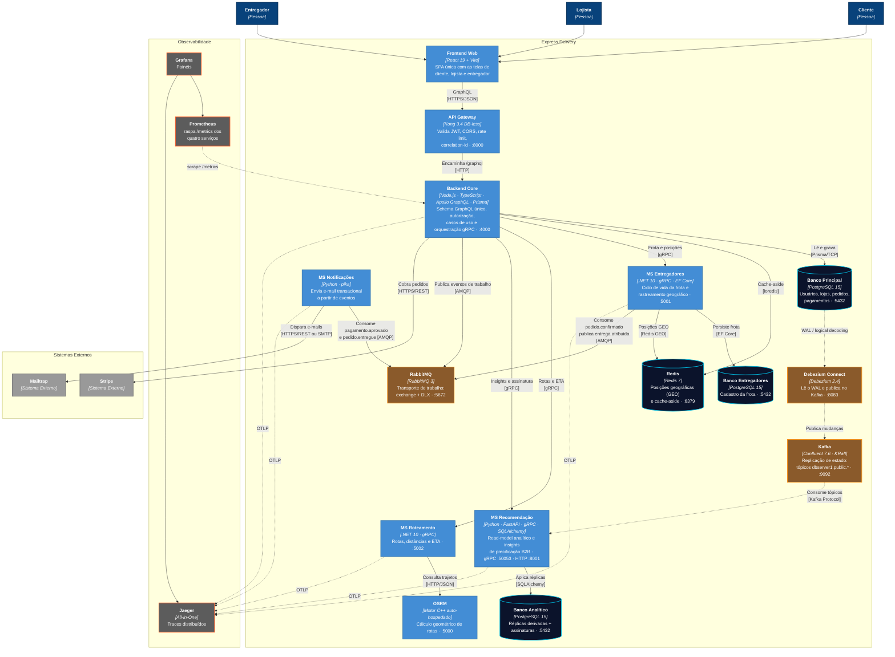

# C4 — Nível 2: Contêineres

Zoom dentro do Express Delivery: as unidades executáveis, os bancos, os brokers e
a stack de observabilidade. Cada caixa aqui é algo que sobe no `compose.yml`.

> **Escopo:** o sistema Express Delivery · **Público:** quem vai desenvolver, operar ou avaliar a arquitetura

As portas indicadas são as **internas da rede Docker** — é por elas que os
contêineres conversam entre si. As portas publicadas no host estão no
[README](../../../README.md#-endpoints-de-acesso-via-gateway).

## Como ler este diagrama

| Traço | Significado |
| :--- | :--- |
| Linha cheia | Chamada síncrona: quem chama espera a resposta |
| Linha tracejada | Fluxo assíncrono ou telemetria: quem emite não espera |

| Cor | Tipo |
| :--- | :--- |
| Azul escuro | Pessoa |
| Azul | Contêiner (aplicação executável) |
| Azul petróleo | Armazenamento de dados |
| Marrom | Broker de mensageria |
| Cinza | Sistema externo |
| Grafite | Observabilidade |

## Os dois brokers

Não é redundância — cada um resolve um problema diferente:

- **RabbitMQ carrega trabalho.** `pedido.confirmado` leva à atribuição de um
  entregador; `pagamento.aprovado` dispara um e-mail. São tarefas com consumidor
  único e DLQ por fila.
- **Kafka replica estado.** O `ms-recomendacao` não recebe trabalho: ele mantém
  uma cópia analítica do banco principal, derivada do WAL pelo Debezium. Por isso
  ele **não** consome RabbitMQ — o que entra nele é fluxo de dados, com replay e
  ordenação.

## Onde o OSRM aparece

No [Nível 1](../c1/c4_l1_context.md) ele é um sistema externo, porque é um motor
de terceiros. Aqui ele é um contêiner, porque o projeto o auto-hospeda a partir de
um extrato do OpenStreetMap. As duas leituras estão certas em níveis diferentes.

---
[⬅️ Nível 1: Contexto](../c1/c4_l1_context.md) · [README](../../../README.md) · [Nível 3: Componentes ➡️](../c3/README.md)
