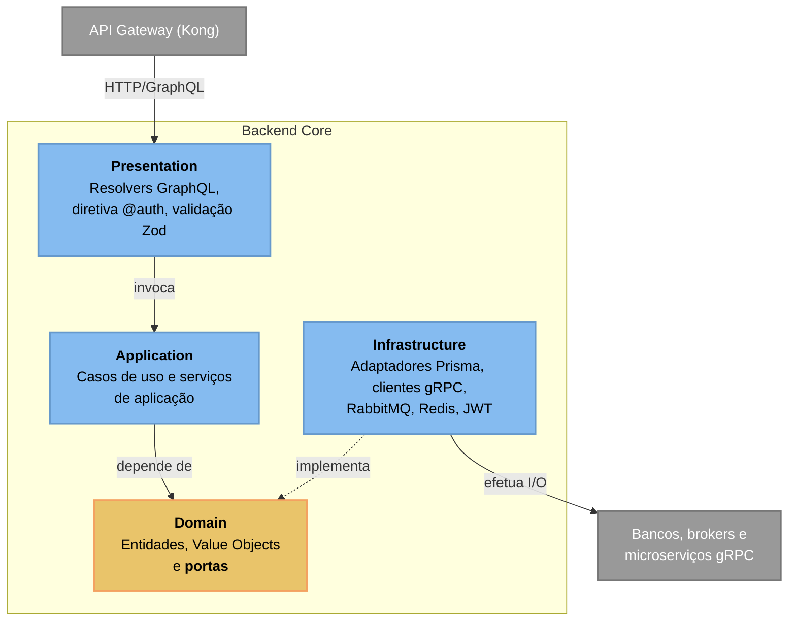
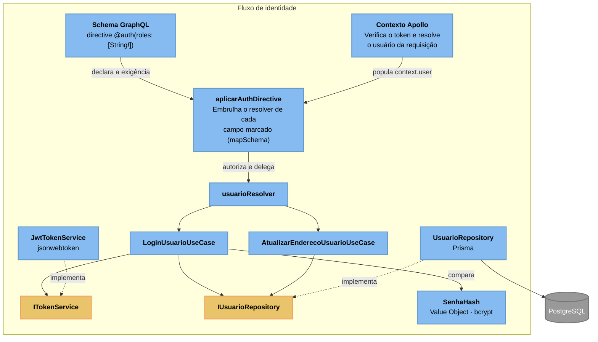

# C3 — Backend Core (`api-node`)

> **Contêiner aberto:** Backend Core · **Stack:** Node.js · TypeScript · Apollo Server · Prisma

É o contêiner com mais componentes do sistema, então está dividido em recortes.
O primeiro mostra a forma geral; os seguintes seguem um fluxo de ponta a ponta.

## 1. Camadas e sentido das dependências

O ponto do diagrama é a seta tracejada: **a infraestrutura aponta para o domínio**,
nunca o contrário. É o que permite trocar Prisma por outra coisa, ou o publisher
do RabbitMQ por um duplo de teste, sem tocar em caso de uso.

Onde isso é violado hoje: `ProcessarPagamentoUseCase` importa as três estratégias
concretas de `infrastructure/strategies` e escolhe com um `switch`. A camada de
aplicação deveria receber a estratégia já resolvida.

O ganho concreto desse desenho é testabilidade: `AtribuirMelhorEntregadorUseCase`
é exercitado em `tests/aplicacao` com dublês de todas as portas, sem banco, gRPC
ou broker. Se um teste de caso de uso precisasse de Docker, a arquitetura não
estaria fazendo o trabalho dela.

## 2. Autenticação e autorização

A diretiva é o middleware central de autorização: a exigência é declarada no SDL
e aplicada por transformação do schema, em vez de repetida em cada resolver. O que
não tem `@auth` é público por decisão explícita.

**O que a diretiva não cobre:** ela decide campo a campo e não enxerga a travessia
do grafo. Um campo liberado pode servir de porta para um tipo que carrega muito
mais do que a tela precisa — foi o caso de `pedidosPorRestaurante → usuario`, que
alcançava a PII do cliente e, por `Usuario.pedidos`, o histórico dele nos
concorrentes. A defesa é de modelagem, não de diretiva: as relações aninhadas
devolvem `UsuarioPublico`, com `id`, `nome` e `endereco`, e a conta completa só é
alcançável por `me`.

## 3. Pedido, entrega e roteamento

```mermaid
graph TB
    classDef comp fill:#85bbf0,stroke:#6699cc,stroke-width:2px,color:#000;
    classDef port fill:#e9c46a,stroke:#f4a261,stroke-width:2px,color:#000;
    classDef ext fill:#999999,stroke:#777777,stroke-width:2px,color:#fff;

    rabbit["RabbitMQ"]:::ext
    msent["MS Entregadores"]:::ext
    msrot["MS Roteamento"]:::ext
    pg[("PostgreSQL")]:::ext
    redis[("Redis")]:::ext

    subgraph log ["Fluxo logístico"]
        direction TB
        resolvers["<b>Resolvers de pedido e entrega</b>"]:::comp

        ucPedido["<b>ConfirmarPedidoUseCase</b>"]:::comp
        ucMelhor["<b>AtribuirMelhorEntregadorUseCase</b>"]:::comp
        ucAtribuir["<b>AtribuirEntregadorUseCase</b>"]:::comp
        ucColeta["<b>ConfirmarColetaUseCase</b>"]:::comp
        ucFinal["<b>FinalizarEntregaUseCase</b>"]:::comp
        ucSim["<b>SimularDeslocamentoUseCase</b>"]:::comp
        ucRota["<b>ObterRotaEstavelUseCase</b><br>ObterRotaColetaUseCase<br>ObterRotaEntregaUseCase"]:::comp

        iPedido["<b>IPedidoRepository</b>"]:::port
        iEntrega["<b>IEntregaRepository</b>"]:::port
        iEntregador["<b>IEntregadorRepository</b>"]:::port
        iRot["<b>IRoteamentoProvider</b>"]:::port
        iPub["<b>IEventPublisher</b>"]:::port

        prisma["<b>Adaptadores Prisma</b>"]:::comp
        grpcEnt["<b>EntregadorRepository</b><br>cliente gRPC"]:::comp
        grpcRot["<b>GrpcRoteamentoProvider</b>"]:::comp
        pub["<b>RabbitMQPublisher</b>"]:::comp
        con["<b>RabbitMQConsumer</b><br>fila api.entrega-atribuida"]:::comp
        resil["<b>resilience.ts</b><br>deadline + retentativa<br>em toda chamada unária"]:::comp
    end

    resolvers --> ucPedido
    resolvers --> ucMelhor
    resolvers --> ucColeta
    resolvers --> ucFinal
    resolvers --> ucSim
    resolvers --> ucRota

    ucPedido --> iPedido
    ucMelhor --> iEntrega
    ucMelhor --> iEntregador
    ucMelhor --> iRot
    ucSim --> iEntregador
    ucSim --> iRot
    ucRota --> iRot
    ucFinal --> iPub
    ucColeta --> iPedido

    con -->|"aplica entrega.atribuida"| ucAtribuir
    ucAtribuir --> iEntrega

    prisma -.->|"implementa"| iPedido
    prisma -.->|"implementa"| iEntrega
    grpcEnt -.->|"implementa"| iEntregador
    grpcRot -.->|"implementa"| iRot
    pub -.->|"implementa"| iPub

    grpcEnt --> resil
    grpcRot --> resil
    resil -->|"gRPC com deadline"| msent
    resil -->|"gRPC com deadline"| msrot
    prisma --> pg
    pub --> rabbit
    con --> rabbit
    ucSim --> redis
```

`AtribuirEntregadorUseCase` é o único caso de uso alcançado por uma mensagem em
vez de uma requisição: o `RabbitMQConsumer` o invoca ao receber
`entrega.atribuida` publicado pelo MS de Entregadores.

## 4. Pagamento, catálogo e recomendação

```mermaid
graph TB
    classDef comp fill:#85bbf0,stroke:#6699cc,stroke-width:2px,color:#000;
    classDef port fill:#e9c46a,stroke:#f4a261,stroke-width:2px,color:#000;
    classDef ext fill:#999999,stroke:#777777,stroke-width:2px,color:#fff;

    stripe["Stripe"]:::ext
    msrec["MS Recomendação"]:::ext
    rabbit["RabbitMQ"]:::ext
    redis[("Redis")]:::ext
    pg[("PostgreSQL")]:::ext

    subgraph fin ["Pagamento e insights"]
        direction TB
        resolvers["<b>Resolvers de pagamento,<br>catálogo e recomendação</b>"]:::comp

        ucPag["<b>ProcessarPagamentoUseCase</b>"]:::comp
        ucIns["<b>ObterInsightsUseCase</b>"]:::comp
        ucAss["<b>AssinarPlanoRecomendacaoUseCase</b>"]:::comp

        iStrategy["<b>IPagamentoStrategy</b>"]:::port
        iPagRepo["<b>IPagamentoRepository</b>"]:::port
        iRec["<b>IRecomendacaoProvider</b>"]:::port
        iPub["<b>IEventPublisher</b>"]:::port
        iRest["<b>IRestauranteRepository</b>"]:::port

        pix["<b>PagamentoPixStrategy</b>"]:::comp
        cartao["<b>PagamentoCartaoStrategy</b>"]:::comp
        stripeS["<b>PagamentoStripeStrategy</b>"]:::comp

        grpcRec["<b>GrpcRecomendacaoProvider</b>"]:::comp
        cache["<b>CachedRestauranteRepository</b><br>decorator de cache-aside"]:::comp
        prismaRest["<b>RestauranteRepository</b><br>Prisma"]:::comp
        pub["<b>RabbitMQPublisher</b>"]:::comp
    end

    resolvers --> ucPag
    resolvers --> ucIns
    resolvers --> ucAss
    resolvers --> iRest

    ucPag --> iStrategy
    ucPag --> iPagRepo
    ucPag -->|"pagamento.aprovado"| iPub
    ucIns --> iRec
    ucAss --> iRec

    pix -.->|"implementa"| iStrategy
    cartao -.->|"implementa"| iStrategy
    stripeS -.->|"implementa"| iStrategy
    grpcRec -.->|"implementa"| iRec
    cache -.->|"implementa"| iRest
    pub -.->|"implementa"| iPub

    cache -->|"delega em caso de miss"| prismaRest
    cache --> redis
    prismaRest --> pg
    stripeS --> stripe
    grpcRec --> msrec
    pub --> rabbit
```

`CachedRestauranteRepository` implementa a mesma porta do repositório real e o
embrulha. A composição acontece no container de injeção de dependência, então nem
o caso de uso nem o resolver sabem que existe cache — e a invalidação fica no
ponto por onde toda escrita passa.

---
[⬅️ Índice do Nível 3](README.md) · [Nível 2: Contêineres](../c2/c4_l2_container.md)
