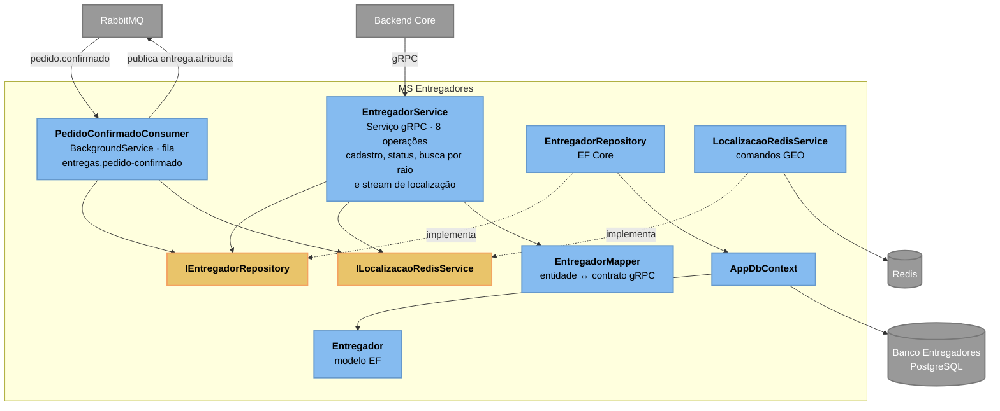

# C3 — MS Entregadores

> **Contêiner aberto:** MS Entregadores · **Stack:** .NET 10 · gRPC · EF Core · StackExchange.Redis

Dono do cadastro da frota e da posição geográfica de cada entregador. É o único
serviço que decide qual entregador recebe um pedido.

## Observações de projeto

**`EntregadorService` concentra oito operações gRPC.** É a implementação da
classe base gerada pelo `.proto`, então cada método é um `override` que delega ao
repositório. Separar exigiria uma camada de mediação só para redistribuir
delegação — o ganho não paga o custo. O único método com lógica real é
`BuscarProximos`, que cruza o raio geográfico do Redis com o status no banco.

**`Entregador` é um modelo anêmico.** Cinco propriedades, nenhum comportamento.
É deliberado: a classe é mapeada por convenção pelo EF Core, e colocar invariantes
nela brigaria com o change tracker. As regras de transição de status vivem no
`StatusEntregador` do Backend Core.

**O mapeamento de status precisa ser explícito.** O gerador de protobuf converte
`EM_ENTREGA` em `EmEntrega`, então `Enum.TryParse` sobre o valor gravado no banco
falhava e caía no fallback — um entregador ocupado era reportado como offline
pelo gRPC. O `EntregadorMapper` passou a traduzir com um `switch` sobre as
constantes, e há teste cobrindo cada valor.

**A escrita e a publicação não são atômicas.** O consumidor atualiza o status do
entregador no banco e depois publica `entrega.atribuida` em passos separados: se o
processo cair no meio, o pedido fica sem entregador atribuído. É a mesma dívida
descrita na seção de trade-offs do [README](../../../README.md).

---
[⬅️ Índice do Nível 3](README.md) · [Nível 2: Contêineres](../c2/c4_l2_container.md)
