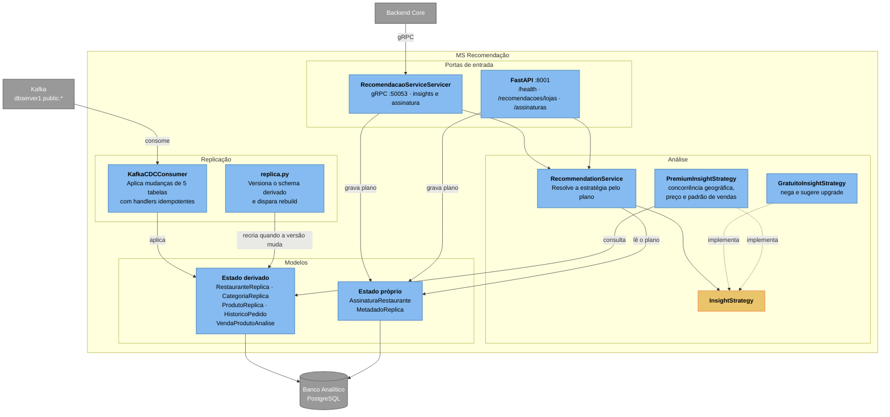

# C3 — MS Recomendação

> **Contêiner aberto:** MS Recomendação · **Stack:** Python 3.12 · FastAPI · gRPC · SQLAlchemy · kafka-python

Motor de inteligência competitiva de precificação B2B. É um **read-model puro**:
não recebe trabalho de ninguém, apenas mantém uma cópia analítica do banco
principal e responde consultas sobre ela. Por isso não consome RabbitMQ.

## Estado derivado contra estado próprio

A separação em dois grupos de modelos é a decisão de projeto mais importante deste
contêiner.

**Estado derivado** é tudo que veio do banco principal pelo CDC. Pode ser jogado
fora e reconstruído relendo o tópico desde o snapshot do Debezium. Por isso uma
mudança de schema aqui não pede migration: pede **rebuild**. O `replica.py`
guarda uma versão do schema e, ao detectar divergência, recria as tabelas
derivadas — o `group_id` do consumidor carrega essa versão, então o Kafka
reentrega tudo desde o começo.

**Estado próprio** é o que só existe aqui: o plano comercial contratado e a versão
do schema. Um rebuild não pode apagá-lo.

Antes, o plano morava em `RestauranteReplica.plano`, ou seja, dentro de uma tabela
replicada. Isso transformava uma operação rotineira — reconstruir a réplica — em
perda das assinaturas de todos os lojistas.

## Idempotência

O Debezium entrega *at-least-once*: reprocessar é comportamento normal, não
exceção. Duas escolhas garantem convergência:

- os handlers aplicam **estado completo** (o campo `after` do envelope), não
  deltas — reaplicar a mesma mensagem leva ao mesmo resultado;
- `VendaProdutoAnalise.item_pedido_id` é `unique`, e é a chave natural da origem,
  o que impede duplicar vendas num replay.

Isso não é só afirmado: `tests/test_cdc_consumer.py` reprocessa o tópico inteiro
e verifica que as contagens não mudam.

## A réplica é descartável, e o compose leva isso a sério

O banco analítico roda em `tmpfs`: some a cada `docker compose down` e é
reconstruído pelo snapshot do Debezium na subida seguinte. Persistir estado
derivado não traz benefício e cria deriva — o `prisma db push --force-reset` do
Backend Core derruba o schema da origem, e DDL não é capturado por logical
decoding, então as linhas antigas sumiriam sem gerar evento de delete e a réplica
guardaria órfãos.

Pelo mesmo motivo a publication do Postgres é criada `FOR ALL TABLES`. Com uma
lista fixa de tabelas, o `DROP TABLE` do reset as removia da publication e a task
do Debezium morria em silêncio: o CDC parava de funcionar a partir da segunda
subida do ambiente.

---
[⬅️ Índice do Nível 3](README.md) · [Nível 2: Contêineres](../c2/c4_l2_container.md)
