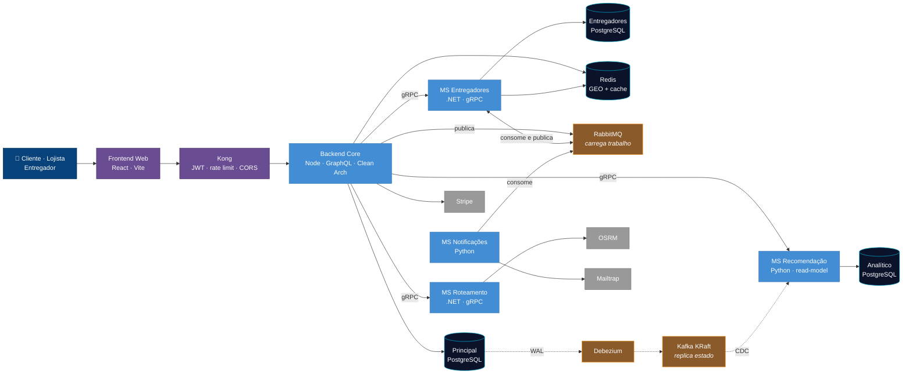
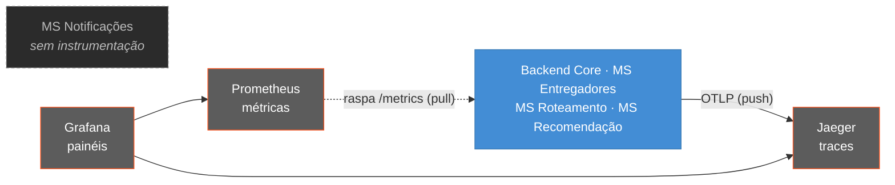

# Visão Geral da Arquitetura

Todo o sistema em uma tela. Não é um nível do C4 — é um *system landscape*, feito
para apresentar o projeto e para servir de mapa antes de entrar nos níveis
[C1](c1/c4_l1_context.md), [C2](c2/c4_l2_container.md) e [C3](c3/README.md).

> **Versão interativa:** [Planta do Express Delivery](https://arthurair3s.github.io/express-delivery-system/diagramas/planta.html)
> — clique numa peça para isolar as dependências dela, filtre por camada
> (síncrono, trabalho, replicação, observabilidade) e leia a ficha de cada
> contêiner. É a versão feita para apresentar o projeto.

## O sistema, sem a observabilidade

Os contêineres que atendem uma requisição e movem um pedido. A telemetria sai
daqui de propósito: ela toca **todos** os serviços, e desenhá-la junto cruzava o
diagrama inteiro com arestas que não ajudam a entender o fluxo. Ela tem o próprio
diagrama, logo abaixo.

O agrupamento é por **cor**, não por caixa — subgraphs forçavam o Mermaid a
empilhar peças que conversam em todas as direções, e o resultado era ilegível.

**Legenda das cores:** azul-escuro = pessoas · roxo = borda · azul = aplicação ·
preto = dados · marrom = mensageria · cinza = sistemas externos.

## A observabilidade, em separado

Um padrão em duas direções que costuma se perder quando desenhado junto com o
resto: **cada serviço empurra traces, o Prometheus puxa métricas.**

Os quatro serviços instrumentados aparecem numa caixa só porque têm exatamente a
mesma relação com as duas pontas — repetir oito arestas idênticas não
acrescentaria informação.

O `ms-notificacoes` está solto no diagrama porque está solto no sistema: é o
único serviço sem instrumentação — não expõe `/metrics` nem exporta traces, por
ser apenas um consumidor de fila, sem servidor HTTP. É uma lacuna conhecida, não
uma simplificação do desenho.

## Os dois caminhos que valem entender

**Síncrono, da esquerda para a direita.** O navegador fala GraphQL com o Kong, que
valida o token e encaminha ao Backend Core. Ele orquestra os microserviços por
gRPC — com deadline e retentativa em cada chamada — e responde.

**Assíncrono, por baixo.** Um pedido confirmado vira evento no RabbitMQ, o MS de
Entregadores escolhe o motoboy e devolve `entrega.atribuida`. Em paralelo, o
Debezium lê o WAL do banco principal e alimenta o Kafka, de onde o MS de
Recomendação reconstrói sua réplica analítica.

A separação é proposital: **RabbitMQ carrega trabalho, Kafka replica estado.**

---
[⬅️ README](../../README.md) · [C1](c1/c4_l1_context.md) · [C2](c2/c4_l2_container.md) · [C3](c3/README.md)
