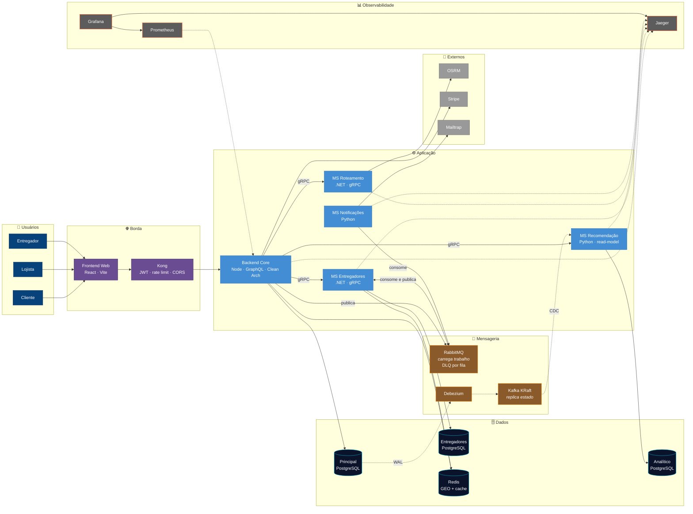

# Visão Geral da Arquitetura

Todo o sistema em uma tela. Não é um nível do C4 — é um *system landscape*, feito
para apresentar o projeto e para servir de mapa antes de entrar nos níveis
[C1](c1/c4_l1_context.md), [C2](c2/c4_l2_container.md) e [C3](c3/README.md).

> **Versão interativa:** [Planta do Express Delivery](https://arthurair3s.github.io/express-delivery-system/diagramas/planta.html)
> — clique numa peça para isolar as dependências dela, filtre por camada
> (síncrono, trabalho, replicação, observabilidade) e leia a ficha de cada
> contêiner. É a versão feita para apresentar o projeto.

## Os dois caminhos que valem entender

**Síncrono, da esquerda para a direita.** O navegador fala GraphQL com o Kong, que
valida o token e encaminha ao Backend Core. Ele orquestra os microserviços por
gRPC — com deadline e retentativa em cada chamada — e responde.

**Assíncrono, por baixo.** Um pedido confirmado vira evento no RabbitMQ, o MS de
Entregadores escolhe o motoboy e devolve `entrega.atribuida`. Em paralelo, o
Debezium lê o WAL do banco principal e alimenta o Kafka, de onde o MS de
Recomendação reconstrói sua réplica analítica.

A separação é proposital: **RabbitMQ carrega trabalho, Kafka replica estado.**

---
[⬅️ README](../../README.md) · [C1](c1/c4_l1_context.md) · [C2](c2/c4_l2_container.md) · [C3](c3/README.md)
